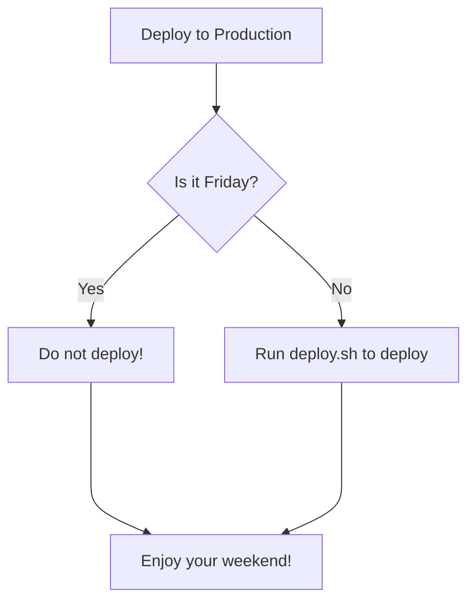

# test

Test whether [mermaid in markdown](https://github.blog/2022-02-14-include-diagrams-markdown-files-mermaid/) works.

If it does, this will render a diagram:

- Test in [github.com](https://github.com/ewan-chalmers/test-mermaid)
- Test in [github.ibm.com](https://github.ibm.com/ewan-chalmers/test-mermaid)
